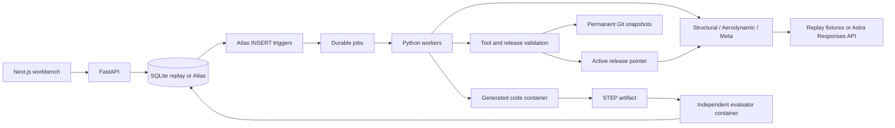

# Architecture and data flow

`generate_round` starts both specialists against the same specification, release, and assembly revision. Their source and parameters are committed to the internal Git repository, then immutable candidate documents are registered. In Atlas mode the candidate trigger queues evaluation; replay mode enqueues through the same repository method. Job IDs are deterministic `kind:subject_id` strings.

`evaluate_candidate` builds each script inside Docker. It then passes only the exported STEP and fixed specification to a clean evaluator container. Results include applicability, metrics with units, violations, exported GLB, duration, and the runtime image digest. Candidate Python cannot directly supply the accepted mass/stress/drag scores.

`reflect_on_evaluation` records memory and attempts an atomic round transition when both component evaluations are available. A single reflection job owns that transition. The meta-agent can create a tool, propose a release, and run validation. Passing component pairs also receive a shared-assembly BRep collision/travel/mass check. Only after the round finishes does the release pointer advance.

## Recovery model

Jobs use renewable leases and fencing tokens. A stale worker cannot mark a newer worker's job complete. Evidence IDs are deterministic so replayed delivery does not duplicate accepted evaluations. Workers reconcile missing evaluation/reflection jobs every 15 seconds. Infrastructure exceptions retry three times; geometry failures are ordinary evaluation outcomes. Run cancellation prevents new claims and causes active runner loops to terminate containers.

There is one active run slot per workspace. A single worker process starts two threads and shares a two-container semaphore. Supporting multiple distributed worker processes would require moving concurrency slots into the database or an external queue.

## Document ownership

| Collection | Contents | Update policy |
|---|---|---|
| `specifications` | Materials, interfaces, loads, limits, baseline | Content-derived immutable versions |
| `candidates` | Source, commit, parameters, state, release, assembly parent | Immutable |
| `evaluations` | Measured metrics, violations, artifacts, evaluator/image version | Immutable |
| `assemblies`, `champions` | Integrated components, score, artifact references | Immutable snapshots |
| `agent_states` | Model identity, retrieved evidence, tools, decision summary | Immutable; no hidden reasoning state |
| `tools` | Python source, I/O schemas, tests, applicability, commit | Immutable version per source |
| `policies`, `releases` | Agent policies, editable source files, predecessor and validation | Immutable versions |
| `pointers` | Active run/release IDs | Atomic compare-and-set |
| `memories` | Canonical summaries, structured parameters, embeddings | Summary immutable; embedding readiness updated |
| `jobs`, `runs`, `budgets` | Scheduling, leases, checkpoints, reservations | Atomic updates |
| `events`, `inspections` | Lifecycle evidence and browser captures | Append-only |
| `artifacts` / GridFS | Hash-addressed geometry, source, logs, screenshots | Append-only |

All application timestamps are UTC ISO-8601 strings for parity between backends. Atlas setup installs document validators, claim/history indexes, unique job and evaluation indexes, and a 1,536-dimensional cosine vector index. The Atlas collection filter is applied before vector search. Local retrieval is explicitly lexical/structured and never presented as Vector Search.

## Interfaces

`build(parameters, interfaces) -> cadquery.Assembly` is the candidate contract. The evaluator accepts only the documented plate/NACA extrusion families. `run(arguments) -> dict` is the generated-tool entry point, checked against stored JSON schemas. `adapt(parameters, policy, subsystem) -> dict` is the editable orchestration extension. `PolicyNote.tsx` is a default-exported React component compiled/rendered into an isolated panel.

The API's `/docs` endpoint exposes current request/response routes. Server-sent events support `Last-Event-ID`; the frontend also polls the materialized workbench state to recover from disconnects. Geometry artifacts are streamed through the server-side proxy. Browser inspection uses a persistent Playwright session and a bounded Astra action/screenshot loop; replay inspections deterministically exercise the same camera controls.

## Scope of self-improvement

The harness improves application state, utility code, orchestration heuristics, and one UI component. It does not train model weights, rewrite the independent evaluator, modify infrastructure credentials, or claim that fixture replay demonstrates autonomous LLM performance. Fresh-API validation with Astra and Atlas is a separate acceptance step once credentials are configured.

Next engineering phases: meshed FEA and convergence checks, viscous aerodynamic analysis, richer tool contracts, geometry families with matching evaluators, full frontend release deployment, distributed worker scheduling, and validated physical reference data.
