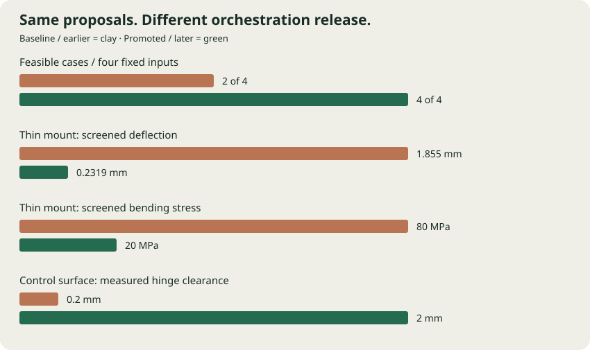
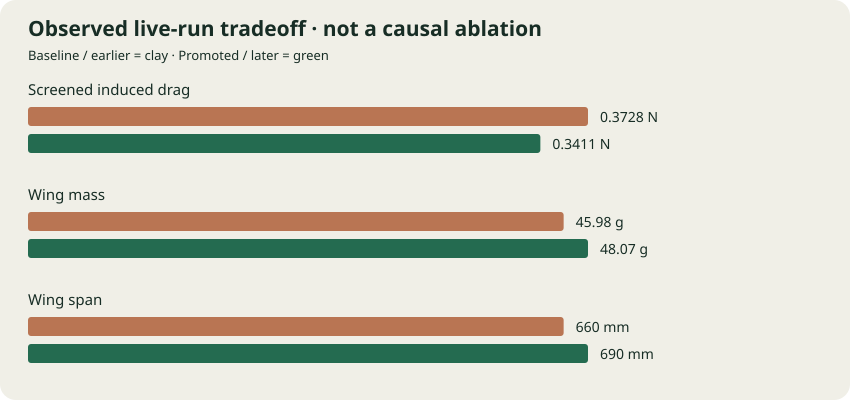

The controlled comparison changed feasibility from **2/4 to 4/4** on the four archived inputs. Two are known failure cases and two are passing controls. This is an in-sample regression demonstration of the promoted release, not an estimate of performance on unseen designs.

| Fixed input | Baseline result | Promoted result | Parameter intervention |
|---|---|---|---|
| Structural failure | failed | passed | thickness_mm: 1.5 → 3 mm |
| Aerodynamic failure | failed | passed | hinge_gap_mm: 0.2 → 2 mm |
| Structural control | passed | passed | thickness_mm: 3 → 3 mm |
| Aerodynamic control | passed | passed | hinge_gap_mm: 2 → 2 mm |

**Engineering tradeoff.** The thin mount becomes thicker and heavier: 12.86 → 25.72 g. That change fixes thickness and deflection violations. The hinge adjustment fixes clearance and travel collision; it does not establish a drag benefit. Passing controls retain their original parameters.

### Iteration gains and live results

The deterministic replay demonstrates recovery followed by optimization:

| Comparison | Earlier | Later | Meaning |
|---|---:|---:|---|
| Passing mount mass, replay rounds 2 → 3 | 30.86 g | 25.72 g | 16.7% lighter |
| Screened wing drag, replay rounds 1 → 4 | 0.4511 N | 0.3411 N | 24.4% lower; span and mass increase |

Replay geometry choices are scripted fixtures. They demonstrate the loop but are not autonomous Astra discoveries.

The later live run has **8.5% lower induced-drag screening** and **4.5% greater wing mass**. Both the release and available context differ between these runs, so this comparison is observational. The controlled experiment above isolates the saved release's adaptation behavior; it does not attribute this drag change to that release.

### Validation ledger

| Recorded run | Evaluations | Passing | Accepted assemblies |
|---|---:|---:|---:|
| replay | 8 | 6 | 3 |
| live1 | 8 | 8 | 4 |
| live3 | 4 | 4 | 2 |

A separate live2 attempt failed before evaluation because a trigger used the wrong handler. It remains in the historical ledger and its spend is included below. The handler was corrected and invalid-job quarantine added.

Recorded validation spend: **$1.3045** (application usage ledger, not a billing invoice; earlier credential probes excluded). The demo comparison and screenshot capture make **zero model calls**.

Existing acceptance: **19 Python/API tests + 7 Docker/CAD tests + 4 Atlas browser tests**. Live acceptance timestamp: `2026-09-26T17:58:07.327776+00:00`. These are dated verification results, not a live health indicator.

Controlled experiment provenance

Executed: `2026-09-26T18:25:07.172192+00:00`. Eight real CadQuery evaluations; fixed sources, inputs, specification and image. Only the archived orchestration/policy release changes between paired arms.

Image: `sha256:7c793165d040ff00df45ffb952e5e590725027565bd9fa55011054f257cc1111`

Promoted release: `release-705e594f50cb4728`. Source commit: `072553689d8c300c88cb2c9e911025b13b56e94b`.

