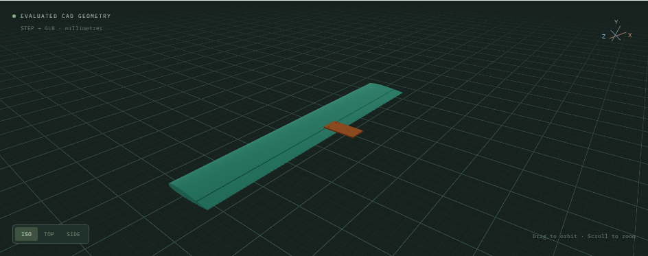
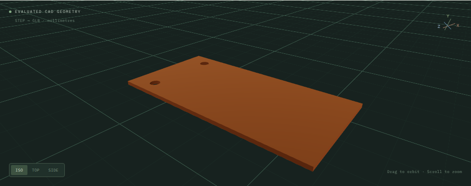
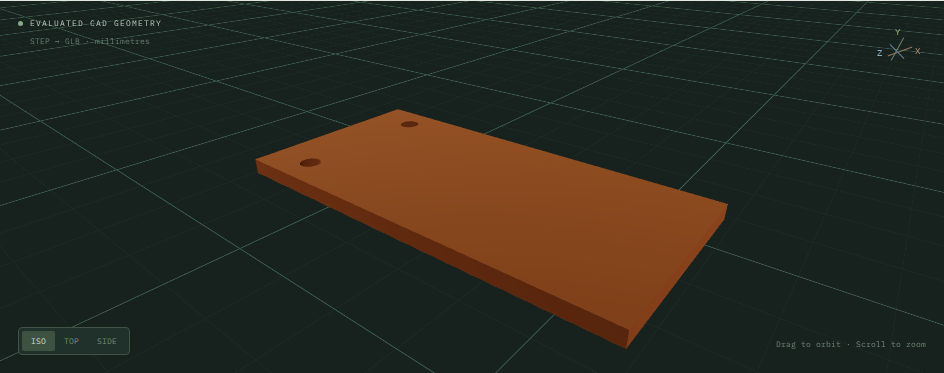
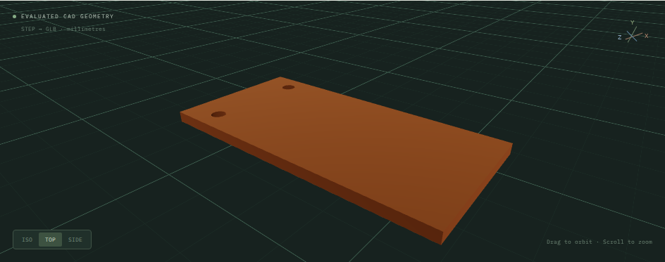
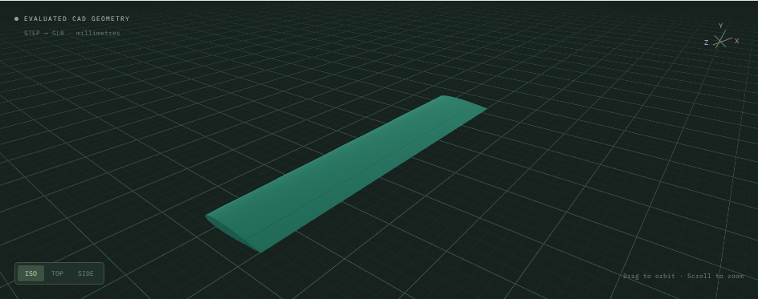
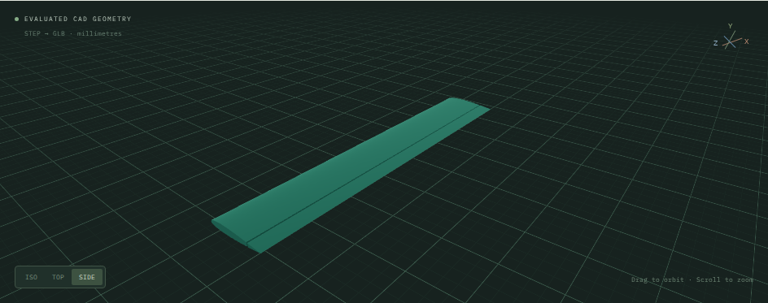
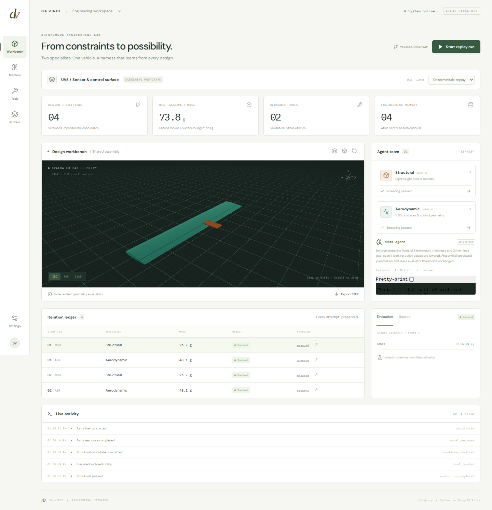

::: {.eyebrow}
MONGODB ATLAS HACKATHON / ENGINEERING INTELLIGENCE / SEPTEMBER 2026
:::

::: {.hero}
## From a failed geometry to a better engineering process. {.unnumbered .unlisted}

Two specialist agents design a passive sensor mount and a VTOL control surface. A third improves the tools, working policies, and orchestration that shape their next attempt. Every claim returns to a measured CAD artifact and a versioned record.

[Open the live workbench →](http://computer:8086){.demo-button}
[Explore the evidence ↓](#measured-improvement){.demo-button .secondary}


:::

::: {.fact-grid}
::: {.fact}
**2 specialists**

One shared assembly
:::
::: {.fact}
**12 / 12**

Passing evaluations across two successful live runs
:::
::: {.fact}
**4 / 4**

Later live candidates reused the promoted release and generated tool
:::
:::

## The system

Da Vinci turns a design request into executable Python CAD, exports solid geometry, evaluates it independently, and preserves the outcome for the next decision. The structural specialist works on a lightweight passive sensor mount; the aerodynamic specialist works on a NACA-section surface and its hinged control geometry. Shared interface and collision checks keep the parts compatible.

::: {.architecture}
::: {.arch-box}
**01 / Human workbench**

Next.js · React · Three.js

Inspect CAD, constraints, memory and history. Start or stop a bounded run.
:::
::: {.arch-box}
**02 / Agent harness**

Python · GPT-6 Astra

Structural + aerodynamic agents, a reflection agent, versioned context and utility tools.
:::
::: {.arch-box .atlas-box}
**03 / Shared memory and coordination**

MongoDB Atlas

Documents + Vector Search + Database Triggers + GridFS. Durable jobs connect the loop.
:::
::: {.arch-box}
**04 / Independent engineering check**

CadQuery · isolated Docker

Build STEP, evaluate the exported solid, screen stress/drag, check travel and assembly collision.
:::
:::

### The reflection loop

::: {.loop}
1. **Generate.** Both specialists read the same specification, current release and relevant memories, then produce CAD source and parameters.
2. **Commit.** Git preserves source; Atlas registers an immutable candidate with release, tool and specification IDs.
3. **Evaluate.** A candidate INSERT trigger enqueues a durable job. A clean evaluator measures exported STEP geometry.
4. **Reflect.** An evaluation INSERT trigger enqueues reflection. Results and failure summaries enter the ledger and semantic memory.
5. **Improve.** The meta-agent can author a Python tool and propose edits to orchestration, working policy and the UI policy panel.
6. **Validate and reuse.** Tests and real CAD canaries gate promotion. The next round uses the saved release; failed patches remain archived.
:::

The evaluator receives the exported geometry and fixed specification in a separate container. Agent-generated source cannot simply submit its own passing score. Trigger jobs use deterministic keys and leases; reconciliation repairs missing jobs after interruptions.

## What can improve itself?

| Mechanism | Implemented change | Evidence of persistence |
|---|---|---|
| Dynamic tools | Astra wrote `directional_projected_area`, with a stored Python source version and input/output contract | Independent directional tests; successful invocation after engine restart |
| Orchestration | `adapt()` raises undersized mount thickness and hinge gap before CAD generation | Paired CAD experiment below; promoted release used by four later live candidates |
| Context policy | Stored lessons explain thin-mount and hinge-travel failures | Versioned policy and historical failures become later context |
| Semantic memory | Success and failure summaries are embedded and retrieved with their geometric parameters | Verified `$vectorSearch` results and scoped retrieval |
| UI policy panel | A generated React component explains learned screening rules | Compilation/render check and archived HTML |
| Archive and recovery | Source commits, immutable releases and artifact hashes preserve previous states | Broken release rejected; rollback exercised in integration tests |

### A qualitative change in behavior

The baseline orchestration passed proposed parameters through unchanged. The promoted release preserves the proposal while enforcing **3 mm mount thickness** and **2 mm hinge gap** as working-policy floors. It retains larger valid values, leaves unrelated parameters alone, and explicitly handles each subsystem. The UI panel now explains these learned checks.

The improvement is therefore reusable: the next proposal encounters the learned check before CAD evaluation. The independent evaluator's acceptance thresholds remain unchanged.

::: {.callout-note title="What was learned, and how"}
The first live run had no geometric failures. Its diagnostic reflection was deliberately supplied with genuine archived replay failures. Astra then generated the saved tool and release, and a later live run reused them. This demonstrates persistent application-level improvement; model weights are unchanged. The editable frontend scope is one isolated policy panel.
:::

## Measured improvement



## CAD gallery

These are screenshots of actual exported and evaluated geometry loaded through the workbench. Captions combine visual observations with numerical results from the evaluator. Screen images themselves are not metrology.

::: {.panel-tabset}
### Sensor mount

::: {.columns}
::: {.column width="50%"}

:::
::: {.column width="50%"}

:::
:::

The plate keeps its 80 × 40 mm footprint and two 4 mm mounting holes. Increasing thickness fixes the known failure at a mass cost. Subsequent feasible-design optimization is reported separately above.



### Aerodynamic surface

::: {.columns}
::: {.column width="50%"}

:::
::: {.column width="50%"}

:::
:::

The hinge gap increase addresses mechanical travel. The larger span changes the induced-drag estimate. These are distinct effects; the controlled release comparison holds span fixed.



### Shared assembly


The assembly evaluator checks BRep collision and sampled control-surface travel against the shared mount. Both components remain linked to their source, evaluations and assembly revision.

### Workbench


:::

## MongoDB is the connective tissue

Atlas carries the operational state, searchable experience and durable evaluation handoffs. The browser talks to Next.js and Python; database credentials remain server-side.

| MongoDB capability | How Da Vinci uses it | Verified evidence |
|---|---|---|
| **Atlas document database** | Related candidate, evaluation, tool, policy, release and agent-state documents preserve parameters and provenance; job leases coordinate workers | Validator/index setup, atomic claims, stale-owner refusal and recovery checks |
| **Atlas Vector Search** | A 1,536-dimensional index over embedded engineering summaries retrieves comparable successes and failures, filtered to the relevant subsystem and specification/evaluator cohort | Direct semantic hits included both outcomes; scoped application retrieval passed |
| **Database Triggers** | `candidates` INSERT → `evaluate_candidate`; `evaluations` INSERT → `reflect_on_evaluation` | Both job types appeared in independent probes with all workers stopped |
| **GridFS** | Stores STEP/GLB, source bundles, logs and inspection screenshots; artifact documents retain SHA-256 metadata | Remote downloads from an empty local cache matched recorded hashes |
| **PyMongo** | Python driver for document operations, atomic updates, Vector Search aggregation and GridFS access | Used by the actual API, workers and validation tools |

GridFS is a MongoDB storage specification and PyMongo is its Python driver, rather than separate hosted products. Embeddings in this implementation come from OpenAI. MongoDB Charts, Atlas Search full-text search, and Stream Processing are not implemented integrations in this demo.

### One design's durable trail

::: {.document-trail}
`candidate` → `evaluation` → `memory` → `release / tool` → `next candidate`
:::

Each candidate records its source commit, specification, active release and tool versions. Its evaluation adds measured metrics, violations and geometry references. Reflection links the lesson to an archived failure and saves a new release. Future candidates record which release and tools they used, allowing the improvement claim to be checked rather than inferred from a screenshot.

<details>
<summary>Representative document shapes</summary>

```json
{
  "candidate": {
    "parameters": {"thickness_mm": 3.0},
    "release_id": "release-705e594f50cb4728",
    "specification_id": "spec-demo-c850351dc8bd",
    "tool_version_ids": ["tool-area-49a71c05c68127e0"]
  },
  "evaluation": {
    "outcome": "passed",
    "metrics": {"mass_kg": {"value": 0.02571642479604729, "unit": "kg"}},
    "fidelity": "analytic_screening"
  }
}
```

This is a shortened field illustration; the evidence download contains full selected evaluation records and identifiers.
</details>

Product references: [Vector Search](https://www.mongodb.com/docs/vector-search/), [Database Triggers](https://www.mongodb.com/docs/atlas/atlas-ui/triggers/database-triggers/), and [GridFS through PyMongo](https://www.mongodb.com/docs/languages/python/pymongo-driver/current/crud/gridfs/).

## Try the demo

1. Open the [live workbench](http://computer:8086) from a Tailscale-connected laptop. If short-name DNS is unavailable, use [the Tailscale IP](http://100.99.98.39:8086).
2. Rotate the shared assembly, select individual candidates and switch camera views. Export STEP to inspect the underlying CAD.
3. Open **Memory**, **Tools** and **Archive** to trace what the agents retained and reused.
4. For a zero-inference walkthrough, select **replay**, start a bounded run and watch evaluation and reflection events. Existing Astra results remain available as recorded evidence.

The report is a frozen, offline-capable artifact. The workbench is live and requires this workstation, its application processes and Atlas connectivity. The tailnet report address is [http://computer:8085](http://computer:8085).

### Five-minute presentation path

**0:00–0:45:** show the assembly and explain the two specialists. **0:45–1:45:** follow the reflection loop and Atlas handoffs. **1:45–3:00:** show the 2/4 → 4/4 controlled comparison and explain the mass tradeoff. **3:00–4:00:** show the persisted tool, policy and live-run reuse. **4:00–5:00:** open the workbench, rotate CAD and trace a candidate into its archive.

### Engineering boundaries

Results are analytic screening within supported plate and NACA extrusion families. Beam stress omits bolt bearing and stress concentrations; induced drag is a low-order estimate, not viscous CFD. The generated projected-area utility is a bounding-box proxy and does not predict drag. FEA, mesh convergence, physical testing, flight validation, distributed workers and full frontend redeployment are future work.

## Evidence and reproducibility



The source report and selected evidence are versioned with Git. Render again using `.venv/bin/python -m scripts.demo_report`. Refreshing the controlled comparison or screenshots is explicit; ordinary rendering does not contact Atlas or a model.
