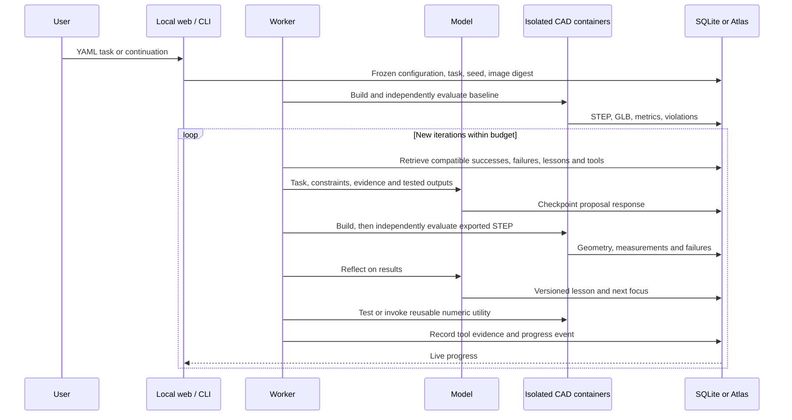

# How improvement works

The product separates the design agent from the evaluator. The existing YAML/gallery workflow below uses the v1 compatibility driver. The [version-2 experiment lifecycle](lifecycle.md) adds draft task authoring, verified frozen suites, external drivers, and typed evidence without requiring a baseline at opening.

Reflection changes the next proposal's context. Retrieval keeps relevant prior failures visible. Tested tools persist and can be reused across compatible runs. These mechanisms improve the search process; they do not retrain model weights or guarantee that each proposal improves performance.

The MVP's generated utility reports objective changes from measured results. It is independently tested and invoked, but never supplies the trusted physical score. Custom task evaluators can incorporate specialized solvers; the installed app and evaluator are not rewritten by the model.

Local mode uses SQLite documents, local content-addressed artifacts, and recent/lexical memory. Atlas mode uses the same records with GridFS and optional vector retrieval. Missing vector indexes trigger an explicit fallback event. Database Triggers are not needed for the product worker.

Run snapshots preserve parameters, source, task hash, runtime image digest, evaluation, reflection, tool versions, and API response usage. Git archives source snapshots. Checkpoints prevent completed model requests from being submitted again after a restart.

One managed worker executes one run at a time. The browser receives events and polls for state reconciliation. The server is localhost-only and rejects unexpected hosts and cross-origin mutation requests. Docker containers have no network, no credentials, limited resources, and no write access to the evaluator source.

The [managed request route](managed-requests.md) adds resumable task/test authoring before this loop. It uses the same lifecycle and job worker, with trusted reference verification before candidate generation. Its automatic verification currently supports the rectangular-beam screening recipe.

## Limits

Sensor evaluation uses a conservative wall-strip screen. The gripper uses a linear frame model and sampled travel checks. VTOL uses the established coupled aerodynamic/energy screening model; the live template does not automatically repeat the historical campaign's finalist convergence study. The UI labels estimates and never claims flight, fatigue, manufacturing, or certification validation.

The beta CST/spline experiment remains separate, unlisted, and unavailable as a product template. Archived campaigns remain unchanged.

Model generation follows the [Responses API](https://developers.openai.com/api/docs/guides/text) and validates the returned JSON before use. The current adapter uses JSON object output with local validation; see [OpenAI structured output documentation](https://developers.openai.com/api/docs/guides/structured-outputs) for the distinction from strict JSON Schema outputs.
